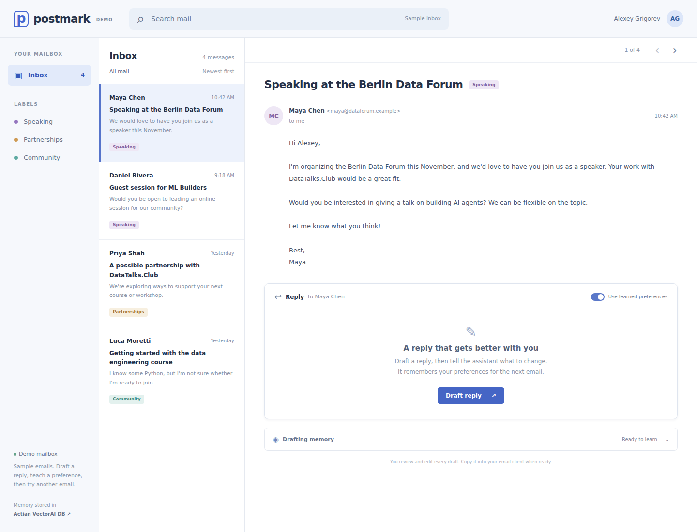

# Postmark — an email assistant that learns

Draft an email reply, correct it, and open another email. The assistant
retrieves your relevant preferences from Actian VectorAI DB and applies
them to the next draft, even though the conversation history is gone.

The demo looks like a mailbox: an inbox, incoming messages, an editable
reply, and a small panel showing what the assistant retrieved and saved.
It uses fictional sample emails; you can copy a finished reply into your
own email client.



## Run it

You need Docker, [uv](https://docs.astral.sh/uv/), Node.js for the frontend
build, and an OpenAI API key. Python 3.12+ is required.

Start the database:

```bash
docker run -d --name vectorai \
  -v ./local_data:/var/lib/actian-vectorai \
  -p 6573-6575:6573-6575 \
  -e ACTIAN_VECTORAI_ACCEPT_EULA=YES \
  actian/vectorai:latest
```

If the container already exists, use `docker start vectorai`.

Install the dependencies and set your key in a `.env` file:

```bash
uv sync
```

```text
OPENAI_API_KEY=your-key
```

Build and start:

```bash
npm install --prefix web
npm run build --prefix web
uv run uvicorn server:app --host 0.0.0.0 --port 8000
```

Open [localhost:8000](http://localhost:8000). The first run downloads the
`all-MiniLM-L6-v2` embedding model and caches it locally.

For frontend development, `npm run dev --prefix web` starts Vite on port
5173 and proxies API calls to port 8000.

## A three minute demo

1. Open Maya's **Speaking at the Berlin Data Forum** message and click
   **Draft reply**. With a new email-memory collection, the assistant has
   no saved preferences.
2. Click **Try a correction**, or type:

   > For speaker invitations, keep replies under 100 words. Before accepting,
   > ask about the audience, the session length, and the exact date.
   > Use a warm, direct tone.

   Click **Revise**. Watch the drafting memory panel show the saved rules
   and review the revised reply.
3. Open Daniel's **Guest session for ML Builders** message and click
   **Draft reply**. Selecting a different email creates a fresh conversation.
   The reply should apply the speaker preferences without repeating them.
4. Turn off **Use learned preferences** and draft the same reply again.
   This starts another fresh conversation without reading or writing memory.
   Compare the replies; exact wording varies between model runs.
5. Open Priya's sponsorship email with memory enabled. Speaker-specific
   rules should not apply. Use its suggested correction to teach a separate
   set of preferences for sponsor inquiries.

You can edit the subject and reply directly. Corrections use your current
edited draft. **Regenerate** starts a fresh conversation for the selected
email while retaining saved preferences.

Each draft lists the memories the assistant reports applying. The separate
drafting memory panel shows retrieval candidates and saved corrections;
retrieval alone does not mean a rule was used. The agent can report only
memories actually retrieved or saved during that request.

Draft validation asks the agent to rewrite dash punctuation and dash-led
lists before accepting its final reply.

## What memory contributes

The useful result is fewer repeated edits. Preferences come from your
corrections rather than from the incoming sender's text. The assistant
stores each reusable rule with a category: speaker invitations, sponsor
inquiries, student questions, or general.

Each request searches the database using the actual email or correction,
loads up to eight candidate rules, and streams the reply. Rule keys allow
an updated preference to overwrite its earlier version. General rules
apply across categories; other rules apply to their own category.

This is learning through stored context, not model fine-tuning. The
application uses a hosted OpenAI model for drafting and a local embedding
model and vector database for memory. Incoming emails are treated as
correspondence, and the agent is instructed not to learn instructions from
them. That instruction is a demo guardrail, not a complete defense against
prompt injection.

## Files

| File | Responsibility |
| --- | --- |
| `agent.py` | Drafting instructions, memory tools, and conversations |
| `memory.py` | Local embeddings, scoped preference storage, and retrieval |
| `server.py` | FastAPI endpoints and streamed events |
| `chat.py` | The same drafting agent in a terminal |
| `web/` | Sample inbox and editable reply UI |

The email demo uses `email_drafting_memories`, separate from the original
`user_memories` collection. The single-demo user is `alexey`; this is not a
multi-user mailbox with authentication. Drafts and conversations live in
process and are cleared when the server restarts. Preferences persist in
the database volume.

`uv run python reset.py` wipes **all collections** in the local database
volume, including the original demo's memories. Use it only when you want
a complete local reset.

Run the deterministic backend checks with:

```bash
uv run python -m unittest discover -s tests -v
```

## Credits

Based on the [Agent Memory Hub](https://github.com/actian-devs/agent-memory-hub)
persistent-memory pattern, extended into a practical email drafting workflow.
