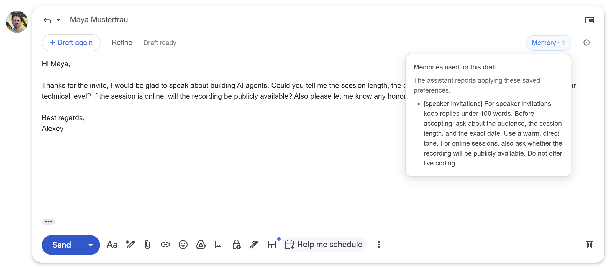

# Gmail Memory Assistant

A Chrome extension that drafts Gmail replies and remembers how you correct
them. Tell it once that speaker invitations should stay under 100 words and
ask about the audience, and every later invitation reply follows that rule,
in any thread and after restarts.



The backend is a [pydantic-ai](https://ai.pydantic.dev/) agent behind a local
FastAPI server. It uses an OpenAI model for drafting, local embeddings
(`all-MiniLM-L6-v2`), and [Actian VectorAI DB](https://www.actian.com/databases/vectorai-db/)
for long-term memory.

## How memory works

1. Draft. You click "✦ Draft" in Gmail. The server retrieves the
   saved rules most similar to the email and gives them to the agent.
2. Correct. You click Refine and describe what to change. The agent
   revises the draft and, if the correction is reusable, saves it with its
   `save_memory` tool as a rule tagged with an email category: general,
   speaker invitations, sponsor inquiries, or student questions.
3. Reuse. On the next email, the agent applies only the rules whose
   category matches. Speaker invitation rules stay out of sponsorship replies.
4. Inspect. Before returning a draft, the agent reports which rules it
   applied. The Memory indicator in Gmail lists them, and the server drops
   any rule the agent names that it was never given.

Each Gmail thread keeps its own conversation history. Saved rules are shared
across all threads.

## Quick start

Requirements: Docker, [uv](https://docs.astral.sh/uv/), Python 3.12+, Chrome,
and an OpenAI API key. Clone the repository and run all commands from it:

```bash
git clone https://github.com/alexeygrigorev/gmail-memory-assistant.git
cd gmail-memory-assistant
```

### 1. Start VectorAI DB

```bash
docker run -d --name vectorai \
  -v ./local_data:/var/lib/actian-vectorai \
  -p 6573-6575:6573-6575 \
  -e ACTIAN_VECTORAI_ACCEPT_EULA=YES \
  actian/vectorai:latest
```

If the container already exists, run `docker start vectorai` instead.

### 2. Start the backend

Create `.env` with `OPENAI_API_KEY=your-key`, then run:

```bash
uv sync
uv run uvicorn server:app --host 127.0.0.1 --port 8000
```

The first run downloads the embedding model. Open
[localhost:8000](http://localhost:8000) to check the service status.

### 3. Install the extension

The extension isn't in the Chrome Web Store, so you load it from this
repository as an unpacked extension:

1. Open `chrome://extensions` in Chrome.
2. Turn on Developer mode in the top-right corner.
3. Click Load unpacked and select the `extension` folder inside the clone.
   Gmail Memory Assistant appears in the extension list.
4. Refresh any open Gmail tabs. The extension only adds its controls to pages
   loaded after it was installed.
5. Open an email and click Reply. If ✦ Draft reply appears above the
   message body, the extension is working.

The extension talks to the backend at `http://localhost:8000`, so keep the
server from step 2 running while you use it. If drafting fails, check that
[localhost:8000](http://localhost:8000) responds.

To update after pulling changes or editing files in `extension/`, click the
reload icon on the extension's card in `chrome://extensions` and refresh Gmail.

## Use it in Gmail

1. Open an email, click Reply, then click ✦ Draft reply above the
   message body. The draft appears in Gmail's editor.
2. Click Refine, type a correction, and click ✦ Draft again.
3. Click Memory in the top-right corner to see which saved rules were
   used. Memory · 0 means no saved rules applied to this draft.
4. Review the reply and send it from Gmail as usual. The extension never sends
   mail.

Memory is always on. The ⚙ menu's Reset conversation clears the
current thread's history but keeps saved rules.

For a scripted walkthrough with three test emails, see [demo.md](demo.md).
Extension details are in [extension/README.md](extension/README.md).

## Reset memory

Wait for any draft generation to finish, then run:

```bash
uv run python reset.py --dry-run   # check the storage path, change nothing
uv run python reset.py             # delete all collections and restart the container
```

This wipes every collection in this repository's `local_data` database.
The reset also marks all backend conversation histories for clearing on the
next request, so restarting the backend is not required. Refresh Gmail and
start with an empty Refine field for a clean draft. If your container isn't
named `vectorai`, pass `--container NAME`.

## Project layout

| Path | Purpose |
| --- | --- |
| `extension/` | Gmail controls and the background streaming client |
| `server.py` | API, memory loading, per-thread conversations, streaming |
| `agent.py` | Agent definition and memory tools |
| `instructions.md` | The agent's drafting and memory rules; edit it to change the prompt |
| `memory.py` | Embeddings, categorized rule storage, and retrieval |
| `reset.py` | Validated local database reset |
| `tests/` | Backend and extension regression tests |

## Tests

```bash
uv run python -m unittest discover -s tests -v
npm ci --prefix tests && npm test --prefix tests   # extension tests, needs Node.js
```

## Limitations

- Local and single-user: one hard-coded user ID, no authentication.
- Email text is sent to the configured OpenAI model.
- Only your own corrections create rules. Incoming emails are treated as
  untrusted and never teach preferences.
- Saved rules persist in the `email_drafting_memories` collection.
  Conversation history lives in memory and clears when the backend restarts.

## More VectorAI DB examples

This project follows the persistent memory pattern from
[Agent Memory Hub](https://github.com/actian-devs/agent-memory-hub). The hub
collects more tutorials, videos, and working code for building agent memory
with VectorAI DB, including other frameworks and edge deployments.
