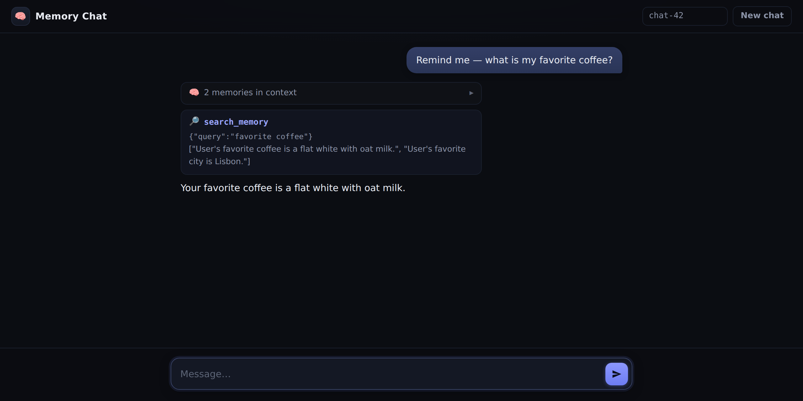

<div align="center">

# Memory Chat

An AI agent that remembers you across chats. Tell it a fact about
yourself once, and every later session knows it, in the browser or the
terminal.




</div>

## Two kinds of memory

The agent has two kinds of memory:

- Working memory is the conversation. It lives in the model's context
  window and is gone when the chat ends.
- Long-term memory holds short facts about the user as embeddings in a
  local [Actian VectorAI DB](https://www.actian.com/databases/vectorai-db/)
  vector database. The facts persist across chats and restarts.

The model writes its own memories with a `save_memory` tool the moment it
notices a lasting fact. Every new session reads the saved facts back into
its instructions.

## Quickstart

You need Docker, an OpenAI API key, and
[uv](https://docs.astral.sh/uv/), the package manager this project
uses. Python 3.12+ is required, and uv installs a matching interpreter
for you when none is found.

Start the vector database once, and leave it running:

```bash
docker run -d --name vectorai \
  -v ./local_data:/var/lib/actian-vectorai \
  -p 6573-6575:6573-6575 \
  -e ACTIAN_VECTORAI_ACCEPT_EULA=YES \
  actian/vectorai:latest
```

Install uv and the project dependencies:

```bash
curl -LsSf https://astral.sh/uv/install.sh | sh
uv sync
```

Put your key in a `.env` file in the repo root:

```bash
echo "OPENAI_API_KEY=sk-..." > .env
```

Build the frontend once, then start the server.

FastAPI serves the built site, so the whole app lives at
[localhost:8000](http://localhost:8000) and Node isn't needed at
runtime:

```bash
cd web && npm install && npm run build && cd ..
uv run uvicorn server:app --port 8000
```

Or run the same agent in the terminal:

```bash
uv run python chat.py Chat-A
```

The first run downloads the `all-MiniLM-L6-v2` embedding model, about
90 MB, and caches it for later runs.

For frontend work, run `npm run dev` in `web/`: Vite serves the UI on
port 5173 and proxies `/api` requests to the backend on port 8000.

## The demo

Run two chats and watch a fact cross from one conversation into the next.

First, ask chat A something the agent doesn't know yet:

```bash
uv run python chat.py Chat-A
# You: What is my favorite coffee?
# Agent: I don't know — you haven't told me yet.
# exit
```

Then share the fact in chat B, and the model calls `save_memory` on its
own while the terminal shows it happening:

```bash
uv run python chat.py Chat-B
# You: My favorite coffee is a flat white with oat milk. And my daughter Mia just turned 5.
# [memory] SAVED: The user's favorite coffee is a flat white with oat milk.
# Agent: Noted — flat white with oat milk, and happy birthday to Mia!
# [memory] SAVED: The user's daughter Mia is 5 years old.
```

Finally, run chat A again.

The conversation history is gone, but the agent loaded its long-term
memories at startup:

```bash
uv run python chat.py Chat-A
# [memory] loaded 2 memories at session start
# You: What is my favorite coffee?
# Agent: Your favorite coffee is a flat white with oat milk.
```

The web UI shows the same thing on screen. Every `save_memory` call
appears as a tool-call card while the answer streams. A fresh session
lists the loaded facts in a memories-in-context card.

## How it works

One file per job:

```text
agent.py    the agent: tools, instructions, sessions, the startup memory load
memory.py   embedding and similarity search against the VectorAI DB
chat.py     the same agent in a terminal session
server.py   the FastAPI app: streams turns as SSE, serves web/dist
reset.py    wipes all memories by emptying the database volume
web/        the vanilla-JS chat UI, built with Vite
```

Every new session embeds the query "personal facts and preferences of
the user" and searches the vector database for the closest stored
facts. Those facts go into the agent's instructions. The agent also has
a `search_memory` tool, so it can search memories mid-conversation.

Saving is a tool call, not a pipeline step. The model calls
`save_memory` when it notices a stable fact. The tool description says
to save stable facts only. A favorite coffee qualifies, and so do the
names of people close to the user, their work, and their goals. Small
talk, moods, and off-the-record remarks stay out.

The tool embeds the fact with a local `all-MiniLM-L6-v2` model and
upserts it into the database. The fact's hash is its point id, so
writing the same sentence twice just overwrites the stored copy.

The agent has a third tool, `get_current_date`, which returns today's
date. It's deliberately trivial, there to show the model picking the
right tool on its own. Every stored fact also includes a `user_id`,
and every search filters on it, so one database can serve many users.

The browser posts each question to `POST /api/chat` and reads the turn
as a Server-Sent Events stream:

- `start` - the turn begins
- `memories` - the facts loaded into the instructions
- `text` - one event per answer delta
- `tool_call` and `tool_result` - the arguments and result of each tool run
- `done` - the turn is complete

Each named session keeps its conversation history in process, so "New
chat" drops the history while the database keeps the memories.

## Resetting the memory

To wipe every stored memory and rehearse the demo from scratch, run:

```bash
uv run python reset.py
```

The script stops the `vectorai` container, empties `local_data/`, and
starts the container again. It wipes the whole volume instead of
deleting points, because this VectorAI DB version (1.0.3) has
unreliable deletes: points can reappear from the write-ahead log.

## Possible improvements

You can extend the agent's memory in a few ways:

- Search memories with the user's actual first question at session
  start, instead of one fixed query. That matters once there are
  hundreds of facts.
- Detect changed facts ("no, I drink tea now") and merge near-identical
  memories by similarity score.
- Add a `forget` tool that deletes a memory by query.

## Credits

mem-hub implements the
[Agent Memory Hub](https://github.com/actian-devs/agent-memory-hub)
tutorial
[How to Build Persistent Agent Memory Across Sessions](https://actiandev.hashnode.dev/how-to-build-persistent-agent-memory-across-sessions).
